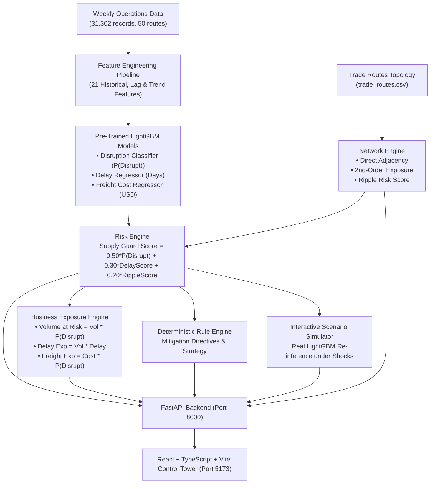

# SUPPLY GUARD 2.0
### Enterprise Supply Chain Control Tower & Risk Intelligence Platform

**Supply Guard 2.0** is an enterprise-grade AI/ML supply chain risk monitoring, network exposure analysis, and scenario stress-testing platform. It turns pre-trained LightGBM predictive models and multi-corridor transit operations data into an interactive, real-time control tower.

---

> [!IMPORTANT]
> **Data & Forecast Disclaimer**  
> This prototype uses a constructed/synthetic dataset (`supply datra/weekly_route_operations.csv` & `trade_routes.csv`). Model outputs, predicted delays, and freight rates should **not** be interpreted as validated real-world forecasts. All exposure figures represent statistical **Estimated Exposure** based on disruption probabilities, not actual realized financial loss or inventory stockouts.

---

## 1. Architecture Overview



---

## 2. Trained ML Models

Supply Guard 2.0 utilizes **three real pre-trained LightGBM models** loaded via `joblib`:

1. **Disruption Model** (`supply_guard_models/disruption_model_v1.pkl`):
   - **Type**: `LGBMClassifier`
   - **Target**: `shipping_delay_days >= 12`
   - **Candidate Operating Threshold**: `0.25`
   - **Performance**: ROC-AUC ≈ 0.843, PR-AUC ≈ 0.243
2. **Delay Model** (`supply_guard_models/delay_model_v1.pkl`):
   - **Type**: `LGBMRegressor`
   - **Target**: `shipping_delay_days`
   - **Performance**: MAE = 1.84 days, RMSE = 2.36 days
3. **Freight Cost Model** (`supply_guard_models/freight_cost_model_v1.pkl`):
   - **Type**: `LGBMRegressor`
   - **Target**: `freight_cost_usd`
   - **Performance**: MAE = $1,269.90, RMSE = $1,638.06

---

## 3. The 21 Engineered Features

The exact training feature pipeline is preserved for production inference (`backend/services/feature_engineering.py`):

| Category | Features |
| :--- | :--- |
| **Operational Variables (7)** | `trade_volume_tonnes`, `container_availability_index`, `port_congestion_index`, `fuel_cost_index`, `commodity_price_index`, `weather_disruption_score`, `geopolitical_risk_score` |
| **Historical Lags & Rolling (9)** | `congestion_lag_1`, `congestion_lag_2`, `congestion_rolling_4`, `weather_lag_1`, `weather_rolling_4`, `geopolitical_lag_1`, `geopolitical_rolling_4`, `container_lag_1`, `previous_was_disrupted` |
| **Trend Metrics (5)** | `congestion_change_1w`, `congestion_change_2w`, `weather_change_1w`, `geopolitical_change_1w`, `container_change_1w` |

---

## 4. Supply Guard Scoring & Business Exposure

### Composite Formula
$$\text{Delay Score} = \text{clip}\left(\frac{\text{Predicted Delay Days}}{21.0}, 0.0, 1.0\right)$$
$$\text{Supply Guard Score} = \left(0.50 \cdot P(\text{Disruption}) + 0.30 \cdot \text{Delay Score} + 0.20 \cdot \frac{\text{Ripple Score}}{100}\right) \times 100$$

### Risk Tiers
- **CRITICAL**: Score $\ge 70$
- **HIGH**: Score $\ge 50$
- **MEDIUM**: Score $\ge 30$
- **LOW**: Score $< 30$

### Modeled Network Exposure & Business Metrics
- **Volume at Risk**: $\text{Trade Volume (t)} \times P(\text{Disruption})$
- **Delay Exposure**: $\text{Volume at Risk (t)} \times \text{Predicted Delay (days)}$
- **Freight Exposure**: $\text{Predicted Freight Cost (USD)} \times P(\text{Disruption})$
- **Ripple Risk Score**: $0.70 \times \text{Avg Direct Risk} + 0.30 \times \text{Avg 2nd-Order Risk}$

---

## 5. Control Tower UI (10 Dedicated Pages)

1. **Overview**: Executive control tower dashboard with Top 8 KPI cards, dynamic risk distribution bars, and clickable top-risk corridors.
2. **Risk Analysis**: Deep dive with SVG Risk Gauge, 4 core predictive pillars, factor breakdown bars, and methodology notices.
3. **Routes**: Full searchable, filterable (Low, Med, High, Critical), sortable directory across all 50 global routes with pagination.
4. **Route Detail**: Complete route profile, current conditions, ML forecasts, network metrics, and automated AI briefings.
5. **Network**: Interactive SVG global transit topology graph showing origin/destination hubs and connected corridor vulnerabilities.
6. **Simulator**: Live stress-testing console with sliders (-30 to +30) and crisis presets. Executes real LightGBM inference to display Baseline vs Scenario vs Deltas.
7. **Business Impact**: Estimated portfolio exposure breakdown, top corridors by volume at risk, and interactive risk-vs-volume scatter matrix.
8. **Recommendations**: Deterministic rule-based action center with mitigation directives and acknowledgment/dismissal workflows.
9. **Historical Trends**: Multi-week time-series charts (7w / 30w / All history) for congestion, weather, geopolitical risk, delay, and costs.
10. **Reports**: Executive risk report generator compiling structured markdown intelligence briefings with copy and download capabilities.

---

## 6. How to Run

### Prerequisites
- Python 3.10+ (tested on Python 3.14)
- Node.js v18+ (tested on v24)

### 1. Launch Backend (FastAPI)
```powershell
# From project root:
python -m uvicorn backend.main:app --host 127.0.0.1 --port 8000 --reload
```
API Documentation will be available at: `http://127.0.0.1:8000/docs`

### 2. Launch Frontend (Vite + React)
```powershell
# In a new terminal, navigate to frontend:
cd frontend
npm install
npm run dev -- --host 127.0.0.1 --port 5173
```
Access the Control Tower at: **`http://127.0.0.1:5173/`**

---

## 7. Production Build
```powershell
cd frontend
npm run build
```
Creates an optimized static bundle in `frontend/dist/`.
